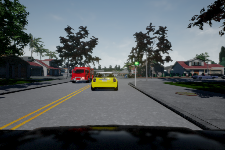
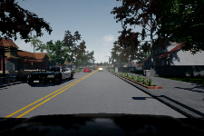
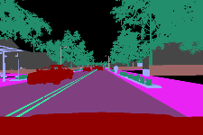

# Semantic Segmentation project

Keywords: Python, TensorFlow, Deep Learning, 
Semantic Segmentation, UNet, Autonomous Driving,
Carla simulator

## Table of contents

1. [ Installation ](#1-installation)
2. [ Introduction ](#2-introduction)  
    2.1 [ Goal ](#21-goal)  
    2.2 [ Results ](#22-results)  
3. [ Project structure ](#3-project-structure)
4. [ Dataset ](#4-dataset)
5. [ Project usage ](#5-project-usage)  
    5.1 [ Record raw data to .tfrecord format ](#51-record-raw-data-to-tfrecord-format)  
    5.2 [ Train a UNet for Semantic Segmentation ](#52-train-a-unet-for-semantic-segmentation)  
    5.3 [ Visualize predictions with trained model ](#53-visualize-predictions-with-trained-model)  
    5.4 [ Export trained model & run inference on Test set ](#54-export-trained-model--run-inference-on-test-set)
6. [ Todo ](#6-todo)
7. [ Resources ](#7-resources)

## 1. Installation

This project was designed for:
* Python 3.6
* TensorFlow 1.12.0

Please install requirements & project:
```
$ cd /path/to/project/
$ git clone https://github.com/filippogiruzzi/semantic_segmentation.git
$ cd semantic_segmentation/
$ pip3 install -r requirements.txt
$ pip3 install -e . --user --upgrade
```

## 2. Introduction

### 2.1 Goal

The purpose of this project is to design and implement 
a real-time Semantic Segmentation algorithm based on Deep Learning.

The designed solution is based on a UNet model implemented in TensorFlow. I use a Focal loss 
to solve the unbalanced data problem among the classes.

### 2.2 Results

The model was trained  on Google Colab for approximately 200 epochs with the 
default parameters.

| Model | Train loss. | Val loss. | Test loss. |
| :---: |:---:| :---:| :---: |
| UNet | 1141 | 1262 | 1262 |




## 3. Project structure

The project `semantic_segmentation/` has the following structure:
* `semseg/data_processing/`: data processing, 
recording & visualization
* `semseg/training/`: data input pipeline, model 
& training / evaluation / prediction operations
* `semseg/inference/`: exporting trained model & inference

## 4. Dataset

Please download this 
[ Semantic Segmentation dataset ](https://www.kaggle.com/kumaresanmanickavelu/lyft-udacity-challenge)
on Kaggle, which is based from the [ Lyft Udacity challenge](https://www.udacity.com/lyft-challenge) 
and extract all files to : `/path/to/carla_semseg_data/`.

The dataset contains approximately 5000 simulated images from the [ Carla simulator ](http://carla.org/).
I split the Train / Val / Test sets with 3000 / 1000 / 1000 images with Semantic Segmentation labels.




## 5. Project usage

```
$ cd /path/to/project/semantic_segmentation/semseg/
```

### 5.1 Record raw data to .tfrecord format

```
$ python3 data_processing/data_to_tfrecords.py --data_dir /path/to/carla_semseg_data/
```

This will record the splitted data to `.tfrecord` format in `/path/to/carla_semseg_data/tfrecords/`.

### 5.2 Train a UNet for Semantic Segmentation

```
$ python3 training/train.py --data-dir /path/to/carla_semseg_data/tfrecords/
```

### 5.3 Visualize predictions with trained model

```
$ python3 training/train.py --data-dir /path/to/carla_semseg_data/tfrecords/
                            --mode predict
                            --model-dir /path/to/trained/model/dir/
                            --ckpt /path/to/trained/model/dir/
```

### 5.4 Export trained model & run inference on Test set

## 6. Todo

- [x] Full training on Google Colab & update results
- [ ] Fix background loss bug & retrain
- [ ] Google Colab demo
- [ ] Inference scripts
- [ ] Add data augmentation

## 7. Resources

This project was widely inspired by:
* _U-Net: Convolutional Networks for Biomedical Image Segmentation_, 
O. Ronneberger, P. Fischer, T. Brox, 
2015, [ Arxiv ](https://arxiv.org/abs/1505.04597)
* _Losses for Image Segmentation_, 
L. Nieradzik, [ Blog post ](https://lars76.github.io/neural-networks/object-detection/losses-for-segmentation/)
* _Carla Simulator_, 
A. Dosovitskiy, G. Ros, F. Codevilla, A. Lopez, V. Koltun, 
[ Website ](http://carla.org/)
* _CARLA: An Open Urban Driving Simulator_, 
A. Dosovitskiy, G. Ros, F. Codevilla, A. Lopez, V. Koltun, 
2017, [ Arxiv ](https://arxiv.org/abs/1711.03938)
* _Lyft Udacity challenge_, 
[ Website ](https://www.udacity.com/lyft-challenge)

